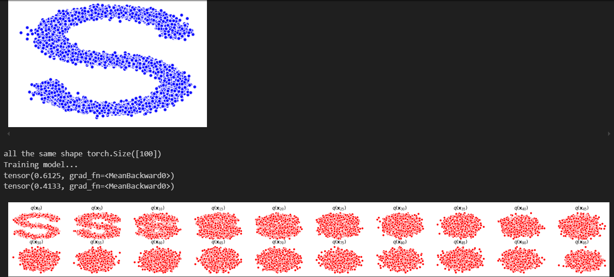

# Diffusion
 

## Reference
1. [李宏毅教授,【生成式AI】淺談圖像生成模型 Diffusion Model 原理](https://www.youtube.com/watch?v=azBugJzmz-o&t=38s)
2. [Jonathan Ho, Ajay Jain, Pieter Abbeel.Denoising Diffusion Probabilistic Models(2020).	arXiv:2006.11239 [cs.LG]](https://arxiv.org/abs/2006.11239)

